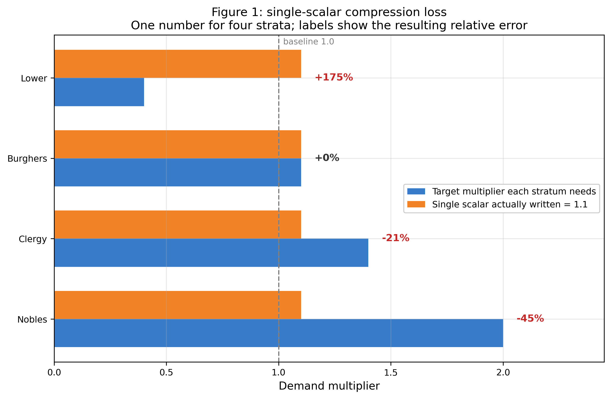
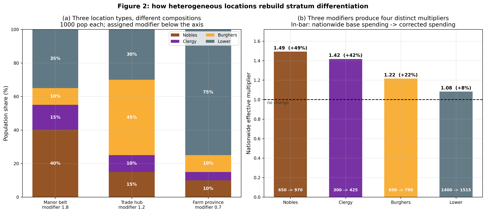
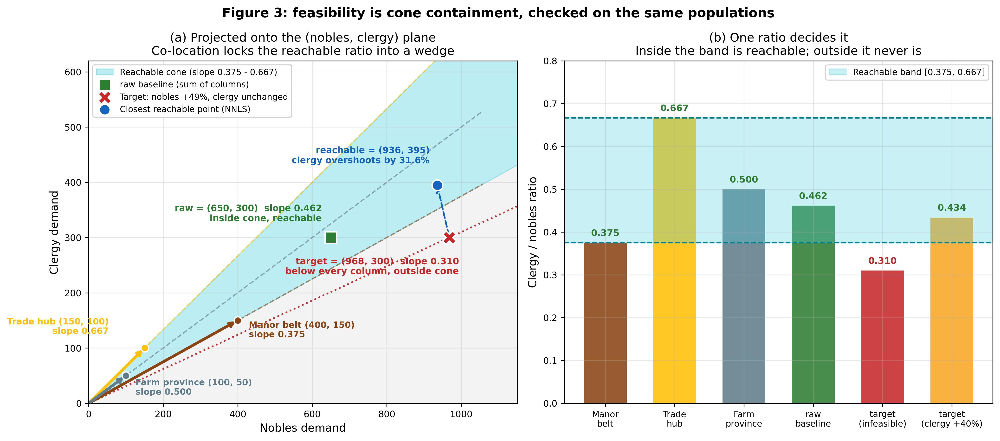
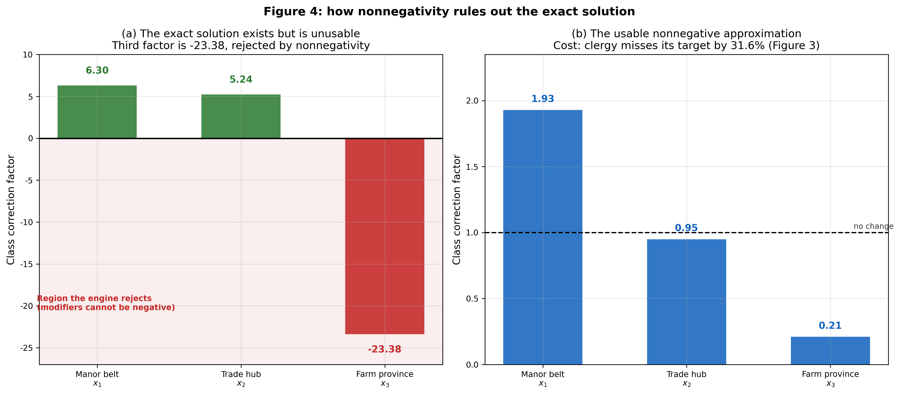

# 一项有趣的技术实践：利用地点人口结构差异实现阶层级控制

**作者注**：这是一篇关于 SOL（Standard of Living）模组国家级需求求解器的技术剖析。如果你阅读后有收获，请考虑支持我在 [Paradox Forum 上的帖子](https://forum.paradoxplaza.com/forum/threads/sol-standard-of-living.1501680/)，由于 PDX 不肯恢复该接口，我不得不付出大量时间和精力来重建模组核心功能。

---

## 目录

1. [瓶颈](#第一节瓶颈)
2. [策略](#第二节策略)
3. [算法](#第三节算法)
4. [求解效果](#第四节求解效果)
5. [性能](#第五节性能)
6. [结论](#第六节结论)

---

## 第一节：瓶颈

在最早的 SOL 设计里，人口需求是精确到 POP 的，理论上可以实现最精确的调控。因此在 1.1 版本的 SOL 模组中，我将功能推进到了 Engel 曲线（即不同商品的需求随财富增长不同）和替代组（即一种商品昂贵时，消费者会转向另一种商品），已经非常接近 Vic3 风格的需求模型。

但是，在 EU 的 1.2 版本更新中，移除了对 pop 的直接访问接口。我理解这是出于性能考虑，转而硬编码文化、宗教等对需求的影响，无需在运行时逐 pop 访问 script values。因此 1.2 版本彻底摧毁了任何在游戏运行时动态调控需求的可能，也同时导致 SOL 模组完全失效。

这种静态需求的设计完全不符合经济模型，毫无疑问 PDX 并非本意如此，因此在 1.3 版本，EU 提供了一个地点级的接口：`local_pop_demand`。它就是一个标量（数字），比如 1.2 或者 0.8，统一调控一个地点的所有阶层需求。

正是由于该接口的出现，我才有机会在 1.3 版本里重建 SOL 模组。然而，由于缺失阶层区分度，我不得不使用地点级聚合（而非最初的阶层级聚合）进行"收入 = 支出"的运算，这就产生了一个很严重的问题。

当你给一个地点设置 `local_pop_demand = 1.2`，这个地点里所有阶层的需求都被乘以 1.2：

- 贵族的丝绸需求 × 1.2
- 教士的书籍需求 × 1.2
- 市民的工具需求 × 1.2
- 农民的粮食需求 × 1.2

然而，由于不同阶层的力量差异，尤其是"农民自主权"的存在，导致一个地点上四个阶层的处境可能天差地别：

| 阶层 | 人均月收入 | 能负担的基线倍数 |
|---|---|---|
| 贵族 | 50 | 2.0 |
| 教士 | 20 | 1.4 |
| 市民 | 15 | 1.1 |
| 下层 | 3 | 0.4 |

现在问题来了：你给这个地点设置一个什么样的 `local_pop_demand`？如果设 1.1（大致的加权平均），贵族本该是 2.0，只拿到 1.1，少了 45%；下层本该是 0.4，却拿到 1.1，多了 175%。无论选什么数字，都是同时对某些阶层不公、对另一些过度补偿。显然，数学上，一个数字无法同时表达四个不同的需求系数。



*图 1：四个阶层（Nobles 贵族 / Clergy 教士 / Burghers 市民 / Lower 下层）的目标倍数被压缩成一个标量后，每个阶层都偏离了自己该有的位置。右侧标注的是相对误差。*

在这种情况下，SOL 的运算结果必然不准。最初，我尝试按照一般国家的阶层结构来成比例地设置初始的 pop demand（就是你在游戏中浏览商品时看到的每 1000 人需求量），以其四阶层开销大致等于其收入。但是这其中的误差远超我最初的乐观估计：

1. 贵族和平民的需求和目标差异极其严重。许多玩家报告其中一个花费是收入的数倍乃至数十倍。尤其是对于农奴制国家，由于农民自主权极低，平民的收入通常不足地点收入的 5%，却占有一半以上的基准开销。

2. 一旦某个阶层开始攒钱，存款不断累积，SOL 算法就会认为"存款压力较高"，进而扩大所有阶层的需求，导致那些本就需求过高的阶层进一步破产，而这些凭空产生的需求又会反过来增强国家的经济，进一步让这个富有的阶层攒更多的钱。

在 260814 更新中，我已经进行了三个直接的修复：

1. 重新开放 EU5 引擎在阶层贫穷时自动降低需求的特性，最多降低贫穷阶层 50% 的需求。此前这个特性被有意关闭，以维持"收入 = 支出"的模型，但其实这个特性是非常有利于阶层差异的。

2. 重新开放 EU5 引擎在商品价格过高时自动降低需求的特性，最多降低 100% 的需求，结合 SOL 根据基础支出控制需求量的特性，这在一定程度上重新实现了商品替代，但没有"组"的概念。此前这个特性被有意关闭，同上。

3. 降低存款压力的上限。这个修正一直使用 -25% 的下限，不设上限，但由于上述原因，在当前版本，设置上限是非常有必要的。

在这三个修复后，阶层开销的极端不均已经被大幅缓解，但仍然无法完全解决问题。在一个 1743 年的观察档中，原本法兰西（倾向自由民）的贵族开销大约是收入的 5 倍，而农民开销大约是收入的 0.5 倍。经过修复后，贵族开销下降至收入的 4 倍左右。

---

## 第二节：策略

在讲解法之前，我想先还原一下这个方案是怎么冒出来的。因为它的推导过程本身就包含了一个后来被数据推翻的假设，而那个假设错在哪里，恰好是理解整个系统的关键。

前几天我意识到一件事：不同地点的阶层比例差别极大。既然如此，理论上可以对不同地点施加额外的修正，暗中模拟出对阶层需求的操控。

拿贵族和农民举例。

地点 A 是偏远乡村，缺乏控制力，贵族占比极低，农民自主权很低。于是贵族很富有、农民很贫穷，算出来可能是贵族 +500%、农民 −50%，而加权平均后是 −40% —— 这个数字高估了农民需求，低估了贵族需求。如果全国都像 A，农民会持续贫穷，贵族会疯狂攒钱。

地点 B 是首都城市，控制力高，贵族占比较高，农民自主权也较高。于是贵族没那么富、农民没那么穷，可能是贵族 +20%、农民 +50%，平均下来 +25% —— 反过来低估了农民需求，高估了贵族需求。如果全国都像 B，农民会持续攒钱、贵族会变穷，只是偏差没 A 那么夸张。

*（顺带一提，这两组数字是自洽的：由平均值反推，A 的贵族只占基础支出的 1.8%，B 占 83.3%，正好对应贵族占比极低 / 较高。乡村里那 1.8% 的支出份额，按人均支出是农民 10 倍算，大约相当于 0.2% 的人口。）*

假设全国只有一个 B 却有很多 A，那么总体上农民还是偏穷、贵族还是偏富；反过来，一个更城市化、自由民更多的国家则会出现贵族偏穷。所以问题的严重程度实际上取决于各地点的"权力分布"以及不同类型地点的相对数量——它不是恒定偏差，而是随国家内部结构变化的。

关键的想法由此而来：如果我们在最终平均结果的基础上再干预一次呢？在贵族较多的 B 上施加需求增益，在贵族较少的 A 上施加需求减益，这就巧妙地抬高了贵族的实际需求总量；反过来则抬高农民的。只要一个国家同时拥有 A 和 B 这样的地点，就有可能重新平衡两个阶层的支出。

再想深一层，这个思路的本质是：把"地点级收入 = 支出"改成"国家级收入 = 支出"。

原本的做法理论上应该在每个地点上分别计算各阶层的流动资金除以基础支出（前者取决于政治力量，后者等于需求 × 商品价格 × 人数）。但因为没有阶层区分度，它退化成了总流动资金除以总基础支出。

新做法则要先汇总每个地点的收入，然后求解出 $n$ 个地点系数（$n$ 为地点数），使得这些系数与各地基础支出相乘后加和，正好等于国家级的各阶层总收入。

这样一共只有 4 个方程（有部落的话 5 个），而自由度非常高——只要任意两个地点的阶层基础支出向量线性无关，就多产生一个自由度。

最初，我的判断是：

> 最少只需抽取 4 或 5 个线性无关的地点，就可以解出一组解，从而真正实现阶层分辨的需求调整。

这个判断有一半是对的：地点异质性确实能重建阶层信号，这是整个系统的基石。错的部分是可行性判据——线性无关保证的是解唯一，但引擎不接受负的 modifier（每个地点的 pop 不可能反过来产出商品），我们需要的是非负解。这两件事完全不同。后面会看到，由于大多数国家的原始地点级修正在阶层上偏差极大、往往需要较大的额外系数，即使方程的可解条件全部满足，解里也通常带着负分量，完全不可用。

但思路本身是可行的：即使找不到精确解也可以近似，哪怕只有 1% 的改善也比完全没有阶层分辨要好。所以真正的难点在于：如何最大限度地实现精确求解，尽可能广地实现近似求解，以及如何确保性能不超标。

验算一下。取三类地点（数据来自真实存档），各 1000 人口，基础支出与人口成正比，modifier 分别设 1.8 / 1.2 / 0.7：

| 地点类型 | 贵族 | 教士 | 市民 | 下层 | modifier |
|---|---|---|---|---|---|
| 贵族庄园区 | 40% | 15% | 10% | 35% | 1.8 |
| 商业中心 | 15% | 10% | 45% | 30% | 1.2 |
| 农业省份 | 10% | 5% | 10% | 75% | 0.7 |

全国合计：

| 阶层 | 不修正 | 修正后 | 有效倍数 |
|---|---|---|---|
| 贵族 | 650 | 970 | +49% |
| 教士 | 300 | 425 | +42% |
| 市民 | 650 | 790 | +22% |
| 下层 | 1400 | 1515 | +8% |



*图 2：左侧是三类地点（Manor belt 庄园区 / Trade hub 商业中心 / Farm province 农业省份）的人口构成，横轴下方标注各自分配到的 modifier。右侧是由此产生的四个全国有效倍数，柱内为基础支出到修正后支出的变化。*

从这个例子中，我们可以清楚地看到这个策略的几个特点：

1. 三个 modifier 产出了四个不同的有效倍数，差异来自加权：贵族的 61.5% 集中在拿到 1.8 的庄园区，而下层有 53.6% 落在拿到 0.7 的农业省份。

2. 注意教士的 50% 和贵族的 61.5% 都在庄园区——想通过加权庄园区抬高贵族，就不可能不把教士一起抬上去，上表里贵族 +49% 而教士 +42% 就是这么绑在一起的。如果目标要求贵族大涨而教士不动，这组人口结构做不到。

3. 地点越多效果越好：可用的类别越多，能产生的组合就越丰富，目标落在可达范围内的机会也越大。反过来，一个只有几个地点的小国，无论怎么分类都凑不出足够的自由度。

真实存档，阶层结构差异有多大？统计三个存档中，每个国家内部各地点的贵族人口份额，看最高与最低差多少倍（只统计有 5 个以上地点的国家）：

| 存档 | 国家数 | 贵族份额跨度 | 最高/最低倍数 | 四类齐全 |
|---|---|---|---|---|
| 1337.10 | 487 | 0.0069 | 3.8 | 193（39.6%） |
| 1386.03 | 430 | 0.0085 | 4.6 | 256（59.5%） |
| 1743.04 | 329 | 0.0128 | 5.8 | 171（52.0%） |

"四类齐全"指四个阶层各自都能找到某个地点，是它相对全国均值超额表示最多的地方，四成到六成的国家都满足。

中位倍数 3.8 到 5.8，也就是说一个国家内部，贵族最密集的地点比最稀疏的高出四到六倍。异质性是真实存在的，而且随时代推进还在上升。

再按国家规模分档，趋势更明显：

| 地点数 | 1337.10 | 1386.03 | 1743.04 |
|---|---|---|---|
| 5–9 | 2.7 | 2.9 | 4.3 |
| 10–49 | 4.5 | 5.0 | 6.0 |
| 50–199 | 6.7 | 9.0 | 7.3 |
| 200+ | 7.2 | 7.5 | 13.2 |

可见由于大国类别数多，内部差异比小国大得多，区分度更高。

---

## 第三节：算法

本节展示了更多的技术细节，如果你不感兴趣，可以直接跳到第四节。

### 3.1 符号

设一个国家拥有 $n$ 个地点 $\{\ell_1, \ldots, \ell_n\}$，划分为 $K$ 个类别 $\{C_1, \ldots, C_K\}$。

阶层集合：$\mathcal{S} = \{\text{贵族}, \text{教士}, \text{市民}, \text{下层}\}$，共 4 个。

已知量（每月在地点脉冲中算出）：

- $I_s(\ell)$：地点 $\ell$ 的阶层 $s$ 的净收入（流动资金）
- $B_s(\ell)$：地点 $\ell$ 的阶层 $s$ 的基础支出
- $m_{\text{raw}}(\ell) = \dfrac{\sum_s I_s(\ell)}{\sum_s B_s(\ell)}$：原始需求系数，即不分类时的收入加权平均

国家级目标：

$$
t_s = \sum_{\ell} I_s(\ell), \qquad s \in \mathcal{S}
$$

也就是每个阶层在全国范围内的流动资金总额。

系统矩阵 $M \in \mathbb{R}^{4 \times K}$：

$$
M_{s,k} = \sum_{\ell \in C_k} m_{\text{raw}}(\ell) \cdot B_s(\ell)
$$

第 $(s,k)$ 元素是：类别 $k$ 中所有地点的阶层 $s$ 的原始加权基础支出之和。

类别修正因子：$\mathbf{x} = (x_1, \ldots, x_K)^\top \in \mathbb{R}^K$。

### 3.2 线性系统

要解的方程是：

$$
M \mathbf{x} = \mathbf{t}, \qquad \mathbf{x} \geq \mathbf{0}
$$

其中 $\mathbf{t} = (t_{\text{贵}}, t_{\text{教}}, t_{\text{市}}, t_{\text{下}})^\top \in \mathbb{R}^4$。

两部分的含义：

- 等式 $M\mathbf{x} = \mathbf{t}$：每个阶层的全国总需求等于它的流动资金
- 约束 $\mathbf{x} \geq \mathbf{0}$：modifier 不能是负数（引擎硬限制）

这是一个带约束的线性系统。去掉非负约束，只要矩阵满秩解就一定存在。加上 $\mathbf{x} \geq \mathbf{0}$ 之后，许多系统就变成不可行。

### 3.3 精确求解

该线性系统有解，当且仅当目标向量 $\mathbf{t}$ 落在 $M$ 的列张成的非负锥内。

非负锥定义为：

$$
\operatorname{cone}(M) := \Bigl\{ \sum_{k=1}^{K} \lambda_k M_{:,k} \;:\; \lambda_k \geq 0 \Bigr\}
$$

其中 $M_{:,k}$ 是 $M$ 的第 $k$ 列。

具体到第二节那组人口结构，三个类别的列向量就是（按贵族/教士/市民/下层排列，$m_{\text{raw}} = 1$）：

$$
M_{:,1} = \begin{pmatrix} 400 \\ 150 \\ 100 \\ 350 \end{pmatrix},
\quad
M_{:,2} = \begin{pmatrix} 150 \\ 100 \\ 450 \\ 300 \end{pmatrix},
\quad
M_{:,3} = \begin{pmatrix} 100 \\ 50 \\ 100 \\ 750 \end{pmatrix}
$$

非负锥就是这三个向量的所有非负组合 $x_1 M_{:,1} + x_2 M_{:,2} + x_3 M_{:,3}$（$x_k \ge 0$）能够到达的点集。$\mathbf{t}$ 在其中 → 可行；不在 → 不可行。

设目标是贵族 +49%、下层 −20%，教士与市民不变，即 $\mathbf{t} = (968, 300, 650, 1120)$。

只看贵族和教士两行就够。教士对贵族的比值，三列分别是 $150/400 = 0.375$、$100/150 = 0.667$、$50/100 = 0.500$，而目标要求 $300/968 = 0.310$。任何非负组合的比值都被夹在 0.375 和 0.667 之间，永远到不了 0.310——因为教士的 50% 和贵族的 61.5% 同在庄园区，抬贵族必然连带抬教士。

这就是"锥外"的严格含义。注意它对目标很敏感：若改成教士 +40%（比值 0.434，落进区间），同一组人口结构下最大相对误差立刻降到 2.7%，几乎可行。可行与否取决于目标是否尊重人口结构里的同址关系，与算法精度无关。

由于非负锥是很窄的区域——三四个非负向量在 4 维空间张成的锥只占整个空间很小一块——大部分情况精确解都不可行。而 $\mathbf{t}$ 由实际收入决定，与人口结构是两套独立演化的量，完全可能落在锥外。

此外，因为每个类别的列都是若干地点列的非负求和，所以

$$
\operatorname{cone}(\text{任意划分}) \subseteq \operatorname{cone}(\text{每地点一列})
$$

如果连每个地点一个独立系数都不可行，那任何分类方案更不可能可行。这给出一个快速判定法：把每个地点当作一个类别跑一次非负最小二乘，若不可行则任何分类方案都不可行。



*图 3：把四维系统投影到（贵族, 教士）平面。左图三条箭头是三个类别的列向量（Manor belt 庄园区 / Trade hub 商业中心 / Farm province 农业省份），青色楔形是它们的非负组合能到达的全部区域；raw 基线落在楔形内，而目标（红叉）的斜率 0.310 低于楔形下界 0.375，所以无论怎么调 $\mathbf{x}$ 都到不了，最近只能到蓝点（教士超出 31.6%）。右图把判定压缩成一个量：教士/贵族比值落在 [0.375, 0.667] 内才可达。注意最右侧那根——目标若改成教士 +40%，比值 0.434 就落回区间内了。*

实际求解中类别数固定为 $K=4$（与阶层数相同），所以 $M$ 是方阵，算法很直接：

1. 计算 $\mathbf{x} = M^{-1}\mathbf{t}$（定维高斯消元）
2. 检查是否所有 $x_k \geq 0$
3. 有负分量 → 不可用，转入近似
4. 否则采纳

复杂度 $O(K^3)$，$K=4$ 时是常数。

与判定可解性时的非负条件相对应，这里有个关键的区分："方程有解"和"解可用"是两件事。第二节那组人口结构做精确求解，得到

$$
\mathbf{x} = (6.30,\; 5.24,\; -23.38)
$$

方程解出来了，$\det \neq 0$，数值上毫无问题。但第三个因子是 $-23.38$，引擎不接受负 modifier，所以这个解存在但不可用。实测中如此的情况很常见。所以求解器的设计目标不是 100% 可行率，而是在确定不可行的前提下找到最佳近似。



*图 4：沿用同一组人口结构。左图是对前三行精确求解的结果，第三个因子深度为负，落在引擎不接受的区域（红色底纹）。右图是非负近似给出的可用解 $(1.93, 0.95, 0.21)$，代价是教士偏离目标 31.6%。*

### 3.4 近似求解

第一步是决定用什么衡量一个候选解的好坏。一个最直接的做法是直接用绝对残差 $\|M\mathbf{f} - \mathbf{t}\|$，但这样各阶层的量纲完全不可比，贵族的流动资金可能是下层的几十倍，绝对误差会被大阶层完全主导。

所以要逐行按目标缩放。对每个阶层 $s$，定义相对残差

$$
r_s(\mathbf{f}) = \frac{\bigl| (M\mathbf{f})_s - t_s \bigr|}{|t_s|}
$$

在此之上取两个标量：

$$
L_1(\mathbf{f}) = \frac{1}{4}\sum_{s \in \mathcal{S}} r_s(\mathbf{f}),
\qquad
L_\infty(\mathbf{f}) = \max_{s \in \mathcal{S}} r_s(\mathbf{f})
$$

$L_1$ 是平均相对偏差（衡量整体拟合），$L_\infty$ 是最坏阶层的相对偏差（衡量有没有阶层被牺牲）。

记 $\mathbf{f} = \mathbf{1}$（所有因子为 1，即完全不修正）为 raw 基线（即上版本 SOL 算法，逐地点均衡），其度量为 $L_1^{\text{raw}}$ 和 $L_\infty^{\text{raw}}$。一个候选 $\mathbf{f}$ 只有在两个度量都不退化时才被接受：

$$
L_1(\mathbf{f}) \le L_1^{\text{raw}}
\quad\text{且}\quad
L_\infty(\mathbf{f}) \le L_\infty^{\text{raw}}
$$

任一条不满足就直接丢弃，不参与比较。因为前者不满足意味着根本没有优化，后者则代表某个本就最糟的阶层变得更糟，玩家的体验会更差。

这里我们选择了 $L_1$ 主导的约束公式，通过硬约束的候选之间，按以下规则比较（设当前最优为 $\mathbf{f}^*$）：

- 若 $L_1(\mathbf{f}) < L_1(\mathbf{f}^*) - 0.01 \cdot L_1(\mathbf{f}^*)$ → 显著更优，接受
- 否则若 $L_1(\mathbf{f}) < L_1(\mathbf{f}^*) + 0.01 \cdot L_1(\mathbf{f}^*)$ 且 $L_\infty(\mathbf{f}) < L_\infty(\mathbf{f}^*)$ → 打平但最坏行更好，接受
- 否则拒绝

也就是说 $L_1$ 上下各 1% 构成一个容差带：落在带内视为平局，转而看谁的最坏阶层更轻。这样以整体拟合为主，又不会在两个 $L_1$ 几乎相同的候选里随机挑一个把某阶层丢掉。1% 显然是一个可以调整的数值，但我没有花费太多时间在上面，因为影响不大。

$M\mathbf{f} = \mathbf{t}$ 加上 $\mathbf{f} \ge \mathbf{0}$ 定义了一个多面体。当目标不可达时，最优解落在边界上——某些分量恰好为 0，或某些方程恰好满足。这些边界点就是"顶点"，由"选哪些行参与消元、哪些列自由"的组合决定。

为了求解这些顶点，代码侧枚举了 209 个（精确行序，自由列）组合，每个走一次定维高斯消元得到候选 $\mathbf{f}$，然后送进上面那套判定。最后选出最优的顶点作为近似解。

注：对存档的离线运算确认这 209 个组合与带部分主元的完整枚举结果完全一致，没有漏解，同时把生成的脚本缩小了 87%。

### 3.5 前置过滤与整体流程

正式求解之前有两道前置过滤，都很便宜。

第一道是尺寸过滤：地点数少于 5 的国家直接走 raw-only 路径，连分类都不做。理由则是鸽巢原理——地点数不足 4 时矩阵最多只有 3 个非空列，本来就凑不满四阶层。

实测支持这个取舍：单地点国家的 scaled L1 中位数从 0.329 只能改善到 0.310，而三地点以上是 0.371 → 0.222；跳过它们砍掉 70% 的 exact-failed 国家计数，只放弃 17% 的遍历量。

第二道是残差过滤：如果 raw 的四行相对残差全部已在容差内，不修正就已经够好，扫掠不可能改进任何东西，直接跳过。不过这一层影响较小。

完整流程：

```
尺寸过滤 ──num_locations < 5──> raw-only（跳过分类与求解）
        │
     5 个地点及以上
        ↓
CMF 开关检查 ──该侧两个开关都关──> raw-only
        │
     至少一个开
        ↓
raw 误差过滤 ──四行全部达标──> 跳过（保持 raw）
        │
     有行超标
        ↓
   精确解（4×4 高斯消元）──成功──> 采纳，策略 id 7
        │
      失败（奇异 / 有负分量）
        ↓
   209 顶点扫掠（硬不退化 + L1 主序）──找到──> 采纳，策略 id 8
        │
     一个都不合格
        ↓
   raw_fallback（四因子全置 1，退化为地点级均衡，策略 id 0）
```

人类国家和 AI 走同一条路径，区别只在 CMF 的四个开关（AI/人类 × 精确/近似）控制各级是否启用。

---

## 第四节：求解效果

这一节在三个时间点上完整重放算法在真实存档上的表现。三个时间点是 1337.10、1386.03、1743.04。

### 4.1 可行率

按运行时的优先级顺序统计每个国家最终走到哪条路径：

| 类别 | 1337.10 | 1386.03 | 1743.04 |
|---|---|---|---|
| 预筛未通过 → raw | 965（67.0%） | 629（59.4%） | 261（44.3%） |
| 不可解 → raw | 55（3.8%） | 47（4.4%） | 82（13.9%） |
| 近似解 | 407（28.2%） | 348（32.9%） | 236（40.1%） |
| 精确解 | 14（1.0%） | 35（3.3%） | 10（1.7%） |
| **合计** | **1,441** | **1,059** | **589** |

几点值得注意：

1. 精确解极其罕见，只占 1.0% 到 3.3%。第三节说过 $K=4$ 的方阵要求所有四个分量非负，这个条件在真实数据上几乎从不满足。当然，由于许多玩家喜欢扩张，国家地点较多，因此预期玩家拥有更高的精确解成功率。

2. 近似解才是主力，覆盖 28.2% 到 40.1%。加上精确解，真正拿到修正的国家占 29.2% 到 41.8%。

3. 不可解主要集中在被预筛挡住的那批小国里。大国无解的比例很低，1337 和 1386 只有 3.8% 到 4.4%，绝大多数都能拿到可采纳的改善。

最后验证第二节那个推论——地点越多效果越好。把进了求解器的国家按规模分档（1337.10 存档）：

| 地点数 | 国家数 | 精确 | 近似 | 无解 | 拿到修正 |
|---|---|---|---|---|---|
| 5–9 | 229 | 3 | 190 | 36 | 84.3% |
| 10–49 | 214 | 6 | 189 | 19 | 91.1% |
| 50–199 | 28 | 2 | 26 | 0 | 100.0% |
| 200+ | 5 | 3 | 2 | 0 | 100.0% |

推论成立：从 84.3% 到 100%，而且 50 个地点以上的国家没有一个失败。类别越多能张成的组合越丰富，目标落在可达范围内的机会也越大。

### 4.2 改善率

下面两张表分别用缩放 $L_1$（平均相对偏差）和缩放 $L_\infty$（最坏阶层偏差）衡量。

改善率是**逐国算完再取中位数**，不是拿中位 raw 除以中位解后——后者会把不同国家的分子分母混在一起，得出的数字不对应任何具体国家。

缩放 $L_1$：

| 路径 | 存档 | 国家数 | raw 中位 | 解后中位 | 改善率中位 |
|---|---|---|---|---|---|
| 精确解 | 1337.10 | 14 | 0.1988 | 0.0000 | 100% |
| 精确解 | 1386.03 | 35 | 0.1910 | 0.0000 | 100% |
| 精确解 | 1743.04 | 10 | 0.1995 | 0.0000 | 100% |
| 近似解 | 1337.10 | 407 | 0.3299 | 0.1083 | 64.4% |
| 近似解 | 1386.03 | 348 | 0.3222 | 0.0960 | 66.9% |
| 近似解 | 1743.04 | 236 | 0.4307 | 0.2616 | 42.9% |

缩放 $L_\infty$：

| 路径 | 存档 | 国家数 | raw 中位 | 解后中位 | 改善率中位 |
|---|---|---|---|---|---|
| 精确解 | 1337.10 | 14 | 0.5596 | 0.0000 | 100% |
| 精确解 | 1386.03 | 35 | 0.4817 | 0.0000 | 100% |
| 精确解 | 1743.04 | 10 | 0.3901 | 0.0000 | 100% |
| 近似解 | 1337.10 | 407 | 0.6872 | 0.3486 | 50.0% |
| 近似解 | 1386.03 | 348 | 0.6607 | 0.3237 | 52.2% |
| 近似解 | 1743.04 | 236 | 0.7848 | 0.7073 | 13.4% |

同样有几点值得注意：

1. 精确解 100%：定义使然，精确解就是命中目标，两个度量都归零。

2. 精确解的 raw 那一列：这些国家在不修正时平均偏差已有 19% 到 20%，最坏阶层偏离 39% 到 56%。精确解可行的国家并不是"本来就差不多对了"，它们同样偏得很远，只是恰好落在锥内。

3. 近似解才是主体，样本 236 到 407 个国家。$L_1$ 改善 43% 到 67%，把平均偏差从三成降到一成左右；$L_\infty$ 改善约 50%，最坏阶层从偏离 69% 降到 35%。

### 4.3 预筛效果

尺寸过滤挡掉了大量国家，代价和收益各是多少：

| 项目 | 1337.10 | 1386.03 | 1743.04 |
|---|---|---|---|
| 过滤掉的国家 | 965（67.0%） | 629（59.4%） | 261（44.3%） |
| 放弃的地点遍历量 | 1,751（13.1%） | 1,176（8.7%） | 521（2.7%） |
| 其中本可精确求解 | 0（0.0%） | 2（0.3%） | 0（0.0%） |
| 其中本可近似改善 | 565（58.5%） | 390（62.0%） | 113（43.3%） |
| 其中本来也无解 | 400（41.5%） | 237（37.7%） | 148（56.7%） |

收益很清楚：挡掉四到七成的国家，只放弃 2.7% 到 13.1% 的地点遍历量，对人口需求平衡影响不大。

代价则需要分开看：**几乎没有精确解被牺牲**，这符合预期：不足 4 个地点时矩阵最多只有 3 个非空列，凑不满四阶层。真正被放弃的是近似改善机会：被过滤的国家里有 43% 到 62% 本可以拿到近似解。

这是个性能上的决策。加入预筛代价不高，扫掠触发次数却降低很多。实测发现只有存在预筛时月度运算才达到不可察觉的水平。

---

## 第五节：性能

计量单位取变量操作数（`set_variable` / `change_variable`），它是 Jomini 脚本的主要开销来源。

### 5.1 单位成本

| 阶段 | 成本 | 说明 |
|---|---|---|
| raw 阶段，每地点 | 70 | 五阶层收入、支出、存款压力、raw 系数 |
| 分类 + 矩阵聚合，每地点 | 37 | 份额打分、裁剪、置信度、列累加 |
| 求解器初始化，每国 | 120 | 变量重置、目标与基线求和、容量分配 |
| 精确解（4×4） | 112 | 高斯消元 + 回代 + 非负校验 |
| 单个顶点 case | 218 | 消元 + 回代 + 两个度量 + 接受判定 |
| 完整顶点扫掠（209 个） | 45,562 | 上一行 × 209 |

一次扫掠 45,562，精确解只要 112，差 407 倍。所以性能问题的瓶颈就在于有多少国家会掉进扫掠（近似解）。

回顾 4.1 节的数据：进了求解器的国家里几乎全都会。这也正是为什么要做预筛。

### 5.2 月度总量

下面的数字按第四节实测的路径分布算——扫掠次数取实际落到扫掠的国家数，不是按可行性上界估的。三个时间点分别列出：

| 配置 | 1337.10 | 1386.03 | 1743.04 |
|---|---|---|---|
| 全开 + 预筛 | 22,520,315 | 19,498,487 | 16,635,780 |
| 默认（预筛 + AI 降频） | 2,744,997（12.2%） | 2,507,632（12.9%） | 2,663,573（16.0%） |

预筛的收益在 4.3 节给过：用很小的遍历量代价换掉大部分扫掠触发。

AI 降频再省 84% 到 88%：单机局面里只有一个人类国家，其余全是 AI，它们的求解挪到各自周年脉冲，任一个月只有约 1/12 在解。raw 阶段和 modifier 写入不降频，每月照跑——所以省下的只是求解那部分，而那部分本来就占九成以上。

1743 的降频收益略低（84.0% vs 87.8%），因为那时地点总数最多，而 raw 阶段不受降频影响，它在总量里的占比更高。

值得注意的是三个时间点的总量相当接近（1,660 万到 2,250 万），尽管国家数从 1,441 降到 589。原因是晚期国家更大：地点总数反而从 13,318 涨到 19,535，而扫掠次数从 462 降到 318，两者大致抵消。

### 5.3 开销分布

全开 + 预筛配置下（1337.10）：

| 阶段 | 月度操作数 | 占比 |
|---|---|---|
| raw 地点遍历 | 932,260 | 4.1% |
| 分类 + 矩阵聚合 | 427,979 | 1.9% |
| 求解器初始化 | 57,120 | 0.3% |
| 精确解 | 53,312 | 0.2% |
| 顶点扫掠 | 21,049,644 | 93.5% |
| **总计** | **22,520,315** | **100%** |

---

## 第六节：结论

这个系统说明了一件事：即使引擎 API 极度受限，恰当的数学建模仍然可以把信息找回来。

实际效果：拿到修正的国家占 29.2% 到 41.8%，其中近似解把平均相对偏差改善至多 70%、最坏阶层偏差改善 50%。

精确解虽然是首选路径，但真实数据里只占 1.0% 到 3.3%。

性能上也站得住：默认配置下每存档局面月度 250 万到 270 万次变量操作。实测中，玩家几乎察觉不到任何延迟。
