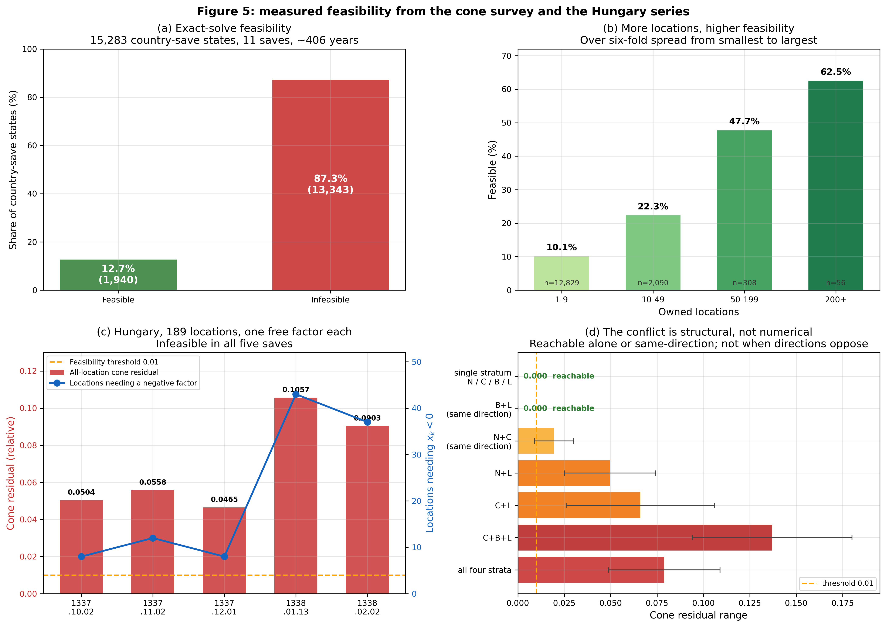

# 为什么单个地点的需求无法区分阶层？又如何在国家层面补偿？

**作者注**：这是一篇关于 SOL（Standard of Living）模组国家级需求求解器的技术剖析。前三节用白话讲问题是什么、方案是怎么想出来的，以及那个想法哪里对哪里错；从第四节开始进入严格的数学建模。如果你喜欢看公式，直接跳到第四节；如果你想看一个设计决策的完整来龙去脉，从头读。

---

## 第一节：信息瓶颈 —— 当一个数字必须代表四个阶层

### 引擎给了我们什么

EU5 引擎提供了一个叫 `local_pop_demand` 的 modifier，作用在每个地点（location）上。它是一个**标量**——就是一个普通数字，比如 1.2 或者 0.8。

当你给一个地点设置 `local_pop_demand = 1.2`，这个地点里**所有阶层**的需求都被乘以 1.2：

- 贵族的丝绸需求 × 1.2
- 教士的书籍需求 × 1.2
- 市民的工具需求 × 1.2
- 农民的粮食需求 × 1.2

听起来没问题。但真实经济不是这样运转的。

### 真实经济中的阶层差异

一个繁荣的商业城市，四个阶层的处境可能天差地别：

| 阶层 | 人均月收入 | 能负担的基线倍数 |
|---|---|---|
| 贵族 | 500 | 2.0 |
| 教士 | 200 | 1.4 |
| 市民 | 150 | 1.1 |
| 下层 | 30 | 0.4 |

现在问题来了：**你给这个地点设置一个什么样的 `local_pop_demand`？**

如果设 1.1（大致的加权平均）：

- 贵族本该是 2.0，只拿到 1.1 → **少了 45%**
- 下层本该是 0.4，却拿到 1.1 → **多了 175%**（他们哪来的钱？）

无论你选什么数字，都是**同时对某些阶层不公、对另一些过度补偿**。这不是实现上的 bug，而是**数学上的不可能**：一个数字无法同时表达四个不同的需求系数。


*图 1：四个阶层（Nobles 贵族 / Clergy 教士 / Burghers 市民 / Lower 下层）的目标倍数被压缩成一个标量后，每个阶层都偏离了自己该有的位置。右侧标注的是相对误差。*

### 为什么这很要紧

你可能会说："反正是游戏，近似一下就好。"

但历史上的经济冲击往往是**阶层特定的**：

- **粮食危机**主要打击农民和城市贫民
- **奢侈品崩盘**主要打击贵族的消费能力
- **战争通胀**对市民打击最大——他们既没有贵族的地租缓冲，也没有农民的自给自足

如果系统用一个标量抹平所有阶层，这些冲击就全被掩盖了。玩家会看到：粮价翻倍，但贵族和农民的需求变化一模一样。战争爆发，所有阶层同步紧缩。

这不只是"不够精确"，而是**整个经济模型丢掉了阶层这个维度**。

### 那怎么办

答案有点反直觉：**单个地点做不到的事，一个拥有多个地点的国家可以做到。**

下一节讲这个想法是怎么冒出来的——包括它当初错在哪里。

---

## 第二节：这个想法从何而来

在讲解法之前，我想先还原一下这个方案是怎么冒出来的。因为它的**推导过程本身**就包含了一个后来被数据推翻的假设，而那个假设错在哪里，恰好是理解整个系统的关键。

### 卡壳的地方

当时项目卡在一个说不通的现象上：某个阶层富得流油，另一个阶层穷得揭不开锅，而这种情况**经常发生**。根源就是第一节那个信息瓶颈——无法控制单个阶层的需求，所以运算结果必然不准。

但有一天我意识到一件事：**不同地点的阶层比例差别极大**。既然如此，理论上可以对不同地点施加额外的修正，暗中模拟出对阶层需求的操控。

### 两个地点的故事

拿贵族和农民举例。

**地点 A 是偏远乡村**，缺乏控制力，贵族占比极低。这里农民的自主权很低，于是贵族很富有、农民很贫穷——算出来可能是贵族 +500%、农民 −50%。而加权平均后的最终结果可能是 −40%。

这意味着什么？这个数字**高估了农民的需求，低估了贵族的需求**。如果全国的地点都像 A，那么农民会持续贫穷，而贵族会近乎疯狂地攒钱。

**地点 B 是首都城市**，控制力高，贵族占比较高。这里农民的自主权也比较高，于是贵族没那么富、农民没那么穷——可能是贵族 +20%、农民 +50%，平均下来 +25%。

这个数字则**低估了农民需求，高估了贵族需求**。如果全国都像 B，农民会持续攒钱、贵族会变穷。当然，这个偏差没 A 那么夸张。

*（顺带一提，这两组数字是自洽的：由平均值反推，A 的贵族只占基础支出的 1.8%，B 占 83.3%——正好对应"贵族占比极低"和"占比较高"。乡村里那 1.8% 的支出份额，按人均支出是农民 10 倍算，大约相当于 0.2% 的人口。）*

现在把它们放到一起。假设全国只有一个 B，却有很多 A，会怎样？总体上农民还是偏穷、贵族还是偏富。反过来，一个更城市化、自由民更多的国家，则会出现贵族偏穷的情况。

这里浮现出一个结论：**SOL 缺乏阶层调控能力这个问题，其严重程度实际上取决于各地点的"权力分布"，以及不同类型地点的相对数量。** 它不是一个恒定的偏差，而是随国家的内部结构变化的。

### 关键的一步

然后是那个想法：**如果我们在最终平均结果的基础上再干预一次呢？**

假设全国只有一个 B、很多 A。我们额外施加一层系数：在贵族较多的 B 上施加需求增益，在贵族较少的 A 上施加需求减益——这就巧妙地抬高了贵族的实际需求总量。反过来，B 上减益、A 上增益，则抬高农民的需求总量。

只要一个国家同时拥有 A 和 B 这样的地点，就有可能重新平衡两个阶层的支出。

### 这本质上是把等式从地点级搬到国家级

再想深一层，我意识到这个思路的本质是：**把"地点级收入 = 支出"改成"国家级收入 = 支出"。**

原本的做法理论上应该在每个地点上分别计算各阶层的流动资金除以基础支出（前者取决于政治力量，后者等于需求 × 商品价格 × 人数）。但因为没有阶层区分度，它退化成了总流动资金除以总基础支出。

新做法则要先汇总每个地点的收入，然后**求解出 $n$ 个地点系数**（$n$ 为地点数），使得这些系数与各地基础支出相乘后加和，正好等于国家级的各阶层总收入。

### 当时的预测，以及它错在哪

这样一共只有 4 个方程（有部落的话 5 个），而自由度非常高——只要任意两个地点的阶层基础支出向量线性无关，就多产生一个自由度。所以当时的判断是：

> 最少只需抽取 4 或 5 个线性无关的地点，就可以解出一组解，从而真正实现阶层分辨的需求调整。

**这个判断有一半是对的，而错的那一半花掉了后面绝大部分工程量。**

对的部分是机制：地点异质性确实能重建阶层信号，这是整个系统的基石。

错的部分是可行性判据。线性无关保证的是**解唯一**，但引擎不接受负的 modifier——我们需要的是**非负解**。这两件事完全不同。后面会看到，$\det(M) \neq 0$、条件数健康、四个地点线性无关，这些条件可以全部满足，而解里依然带着 $-23.38$ 这样的分量，于是完全不可用。

真实的判据是一个几何条件，叫**锥体包含**——第四节会严格定义它，这里只需要知道它比"线性无关"严格得多。

而按这个判据去筛真实存档，结果相当难看：**11 个存档、跨 406 个游戏年、15,283 个国家状态里，只有 12.7% 存在精确解。** 剩下 87.3% 无解。而且这个数字是用**最宽松的模型**测的——每个地点一个独立系数，比任何分类方案的自由度都高；连它都无解，粗粒度的分类更不可能。（完整数据和测法在第六节。）

所以这篇文章后面的内容，本质上是在回答一个当初没想到的问题：*当精确解不存在时，该怎么办？*

---

## 第三节：先把机制验算清楚

在讨论"没有精确解怎么办"之前，得先确认上一节那个机制真的成立。这一节用一组可以逐项手算的数字把它跑通。

### 关键观察

每个地点只能设一个标量 modifier，但**不同地点的人口结构完全不同**：

| 地点类型 | 贵族 | 教士 | 市民 | 下层 |
|---|---|---|---|---|
| 贵族庄园区 | 40% | 15% | 10% | 35% |
| 商业中心 | 15% | 10% | 45% | 30% |
| 农业省份 | 10% | 5% | 10% | 75% |

现在给这三类地点设置**不同的** modifier：庄园区 1.8，商业中心 1.2，农业省份 0.7。

在**国家总量层面**发生了什么？

- **贵族总需求** = 庄园区贵族 × 1.8 + 商业中心贵族 × 1.2 + 农业省份贵族 × 0.7
  庄园区的贵族占比高（40%）而 modifier 也高（1.8），所以贵族总需求被**加权抬升**

- **下层总需求** = 庄园区下层 × 1.8 + 商业中心下层 × 1.2 + 农业省份下层 × 0.7
  农业省份的下层占比高（75%）而 modifier 低（0.7），所以下层总需求被**加权压低**

通过巧妙地选择每个地点的 modifier，我们在国家总量层面**重建了阶层差异**——尽管每个地点内部看起来仍然是一刀切。


*图 2：左侧是三类地点（Manor belt 庄园区 / Trade hub 商业中心 / Farm province 农业省份）的人口构成，横轴下方标注各自分配到的 modifier。右侧是由此产生的四个全国有效倍数，柱内为基础支出到修正后支出的变化。三个 modifier 产出四个不同倍数，这就是阶层差异被重建的地方。*

### 把数字代进去

上面的说法可以直接验算。假设三类地点各有 1000 人口，按上表的比例分布，基础支出与人口成正比（每人 1 单位）。

不修正时（三个 modifier 都是 1）：

| 阶层 | 庄园区 | 商业中心 | 农业省份 | 全国合计 |
|---|---|---|---|---|
| 贵族 | 400 | 150 | 100 | 650 |
| 教士 | 150 | 100 | 50 | 300 |
| 市民 | 100 | 450 | 100 | 650 |
| 下层 | 350 | 300 | 750 | 1400 |

换上 1.8 / 1.2 / 0.7 之后：

| 阶层 | 庄园区 ×1.8 | 商业中心 ×1.2 | 农业省份 ×0.7 | 全国合计 | 相对变化 |
|---|---|---|---|---|---|
| 贵族 | 720 | 180 | 70 | 970 | **+49%** |
| 教士 | 270 | 120 | 35 | 425 | **+42%** |
| 市民 | 180 | 540 | 70 | 790 | **+22%** |
| 下层 | 630 | 360 | 525 | 1515 | **+8%** |

四个阶层拿到了 +49% / +42% / +22% / +8% **四个不同的有效倍数**——尽管每个地点内部所有阶层用的都是同一个数字。

差异从哪来的？看贵族和下层的分布对比：贵族的 61.5%（400/650）集中在拿到 1.8 的庄园区，而下层只有 25%（350/1400）在那里，反倒有 53.6%（750/1400）落在拿到 0.7 的农业省份。**同一组 modifier 经过不同的人口分布加权，就产生了不同的结果。**

这也顺带暴露了这个方法的限度：四个有效倍数**不是自由的**。它们由三个 modifier 和固定的人口分布共同决定，能张成的组合有限。

限度来自**同址**。注意教士的 50%（150/300）和贵族的 61.5%（400/650）都在庄园区——想通过加权庄园区抬高贵族，就不可能不把教士一起抬上去。上表里贵族 +49% 而教士 +42% 就是这么来的，两者绑在一起。如果目标要求贵族大涨而教士不动，这组人口结构做不到。第四节会把这个"做不到"变成可判定的条件。

### 大国占便宜

这个方案有个副作用：**地点越多，效果越好**。

- **大国（100+ 地点）**：可以分成 10–20 个类别，有大量自由度来"调色"
- **小国（5 个地点）**：勉强分成 4 类（刚好对应 4 个阶层），任何一点偏差就会让系统无解

历史上说得通——大帝国确实有更复杂的内部市场结构。但游戏平衡上可能是个问题（大国不仅地盘大，经济模型还更准）。

### 但这不是魔法

机制成立，不代表它总能成功。上一节提到的那个 12.7% 就是代价：绝大多数情况下，四个阶层的目标**同时**命中是做不到的。

上面那组人口结构已经露出了苗头——贵族 +49% 必然拖着教士 +42%。真正的问题是：这种绑定关系什么时候会让目标彻底无法达成？

要把"苗头"变成可判定的条件，需要进入数学。

---

## 第四节：数学建模

### 4.1 符号

设一个国家拥有 $n$ 个地点 $\{\ell_1, \ldots, \ell_n\}$，划分为 $K$ 个类别 $\{C_1, \ldots, C_K\}$。

**阶层集合**：$\mathcal{S} = \{\text{贵族}, \text{教士}, \text{市民}, \text{下层}\}$，共 4 个。

**已知量**（每月在地点脉冲中算出）：

- $I_s(\ell)$：地点 $\ell$ 的阶层 $s$ 的净收入（流动资金）
- $B_s(\ell)$：地点 $\ell$ 的阶层 $s$ 的基础支出
- $m_{\text{raw}}(\ell) = \dfrac{\sum_s I_s(\ell)}{\sum_s B_s(\ell)}$：原始需求系数，即不分类时的收入加权平均

**国家级目标**：

$$
t_s = \sum_{\ell} I_s(\ell), \qquad s \in \mathcal{S}
$$

也就是每个阶层在全国范围内的流动资金总额。

**系统矩阵** $M \in \mathbb{R}^{4 \times K}$：

$$
M_{s,k} = \sum_{\ell \in C_k} m_{\text{raw}}(\ell) \cdot B_s(\ell)
$$

第 $(s,k)$ 元素是：类别 $k$ 中所有地点的阶层 $s$ 的**原始加权基础支出**之和。

**类别修正因子**：$\mathbf{x} = (x_1, \ldots, x_K)^\top \in \mathbb{R}^K$。

### 4.2 线性系统

要解的方程是：

$$
M \mathbf{x} = \mathbf{t}, \qquad \mathbf{x} \geq \mathbf{0}
$$

其中 $\mathbf{t} = (t_{\text{贵}}, t_{\text{教}}, t_{\text{市}}, t_{\text{下}})^\top \in \mathbb{R}^4$。

两部分的含义：

- 等式 $M\mathbf{x} = \mathbf{t}$：每个阶层的全国总需求等于它的流动资金
- 约束 $\mathbf{x} \geq \mathbf{0}$：modifier 不能是负数（引擎硬限制）

**关键**：这是一个**带约束**的线性系统。去掉非负约束，只要矩阵满秩解就一定存在。加上 $\mathbf{x} \geq \mathbf{0}$ 之后，大量系统变成**不可行**。

### 4.3 可行性等价于锥体包含

什么时候有解？**当且仅当目标向量 $\mathbf{t}$ 落在 $M$ 的列张成的非负锥内。**

非负锥定义为：

$$
\operatorname{cone}(M) := \Bigl\{ \sum_{k=1}^{K} \lambda_k M_{:,k} \;:\; \lambda_k \geq 0 \Bigr\}
$$

其中 $M_{:,k}$ 是 $M$ 的第 $k$ 列。

具体到第三节那组人口结构，三个类别的列向量就是（按贵族/教士/市民/下层排列，$m_{\text{raw}} = 1$）：

$$
M_{:,1} = \begin{pmatrix} 400 \\ 150 \\ 100 \\ 350 \end{pmatrix},
\quad
M_{:,2} = \begin{pmatrix} 150 \\ 100 \\ 450 \\ 300 \end{pmatrix},
\quad
M_{:,3} = \begin{pmatrix} 100 \\ 50 \\ 100 \\ 750 \end{pmatrix}
$$

非负锥就是这三个向量的所有非负组合 $x_1 M_{:,1} + x_2 M_{:,2} + x_3 M_{:,3}$（$x_k \ge 0$）能够到达的点集。$\mathbf{t}$ 在其中 → 可行；不在 → 不可行。

第三节末尾那个"做不到"现在可以精确表述了。设目标是贵族 +49%、下层 −20%，教士与市民不变：

$$
\mathbf{t} = (968,\; 300,\; 650,\; 1120)^\top
$$

跑非负最小二乘找最接近的可达点，得到 $\mathbf{x} = (1.93,\; 0.95,\; 0.21)$，对应的预测值是：

| 阶层 | 目标 | 最接近的可达值 | 相对误差 |
|---|---|---|---|
| 贵族 | 968 | 935.5 | 3.4% |
| 教士 | 300 | 394.9 | **31.6%** |
| 市民 | 650 | 640.2 | 1.5% |
| 下层 | 1120 | 1119.3 | 0.1% |

有意思的是，**冲突点不在下层**——它被满足到 0.1%。撑不住的是教士，超出 31.6%。

原因是教士和贵族**同址**：教士的 50%（150/300）在庄园区，贵族的 61.5%（400/650）也在庄园区。要把贵族抬到 968 就必须显著加权庄园区（$x_1 = 1.93$），而这必然把教士一起抬上去。

只看这两个阶层就能证明不可行。教士对贵族的比值，三列分别是：

$$
\frac{150}{400} = 0.375,
\qquad
\frac{100}{150} = 0.667,
\qquad
\frac{50}{100} = 0.500
$$

而目标要求的比值是 $300/968 = 0.310$。**它低于全部三列。** 任何非负组合的比值都被夹在最小值 0.375 和最大值 0.667 之间，永远到不了 0.310。

这就是"锥外"的严格含义。而且注意：如果目标改成教士 +40%（即 $t_{\text{教}} = 420$，比值 0.434 落进 [0.375, 0.667] 区间），同一组人口结构下最大相对误差立刻降到 2.7%——**几乎可行**。可行与否取决于目标是否尊重人口结构里的同址关系，与算法精度无关。

**为什么大部分不可行？**

因为非负锥是一个**很窄的区域**。三四个非负向量在 4 维空间里张成的锥，只占整个空间很小一块。而 $\mathbf{t}$ 由**实际收入数据**决定，与人口结构是两套独立演化的量——它完全可能落在锥外。


*图 3：把四维系统投影到（贵族, 教士）平面。左图三条箭头是三个类别的列向量（Manor belt / Trade hub / Farm province 即庄园区 / 商业中心 / 农业省份），青色楔形是它们的非负组合能到达的全部区域；raw 基线落在楔形内，而目标（红叉）的斜率 0.310 低于楔形下界 0.375，所以无论怎么调 $\mathbf{x}$ 都到不了，最近只能到蓝点（教士超出 31.6%）。右图把判定压缩成一个量：教士/贵族比值落在 [0.375, 0.667] 内才可达。注意最右侧那根——目标若改成教士 +40%，比值 0.434 就落回区间内了。*

这里有个重要的推论：**分类器再怎么优化也救不了不可行的情况**。因为每个类别的列都是若干地点列的非负求和，所以

$$
\operatorname{cone}(M_{\text{任意划分}}) \subseteq \operatorname{cone}(M_{\text{每地点一列}})
$$

也就是说，如果连"每个地点一个独立系数"这个最细模型都不可行，那任何粗粒度的分类方案更不可能可行。

### 4.4 精确解

实际实现中类别数固定为 $K=4$（与阶层数相同），所以 $M$ 是方阵，算法很直接：

1. 计算 $\mathbf{x} = M^{-1}\mathbf{t}$（定维高斯消元）
2. 检查是否所有 $x_k \geq 0$
3. 有负分量 → 不可用，转入近似
4. 否则采纳

复杂度 $O(K^3)$，$K=4$ 时是常数。

这里有个关键的区分：**"方程有解"和"解可用"是两件事。** 前面那组人口结构只有 3 列，但道理完全一样——拿前三行做精确求解，得到

$$
\mathbf{x} = (6.30,\; 5.24,\; -23.38)
$$

方程解出来了，$\det \neq 0$，数值上毫无问题。但第三个因子是 $-23.38$，引擎不接受负 modifier，所以这个解**存在但不可用**。


*图 4：沿用同一组人口结构。左图是对前三行精确求解的结果，第三个因子深度为负，落在引擎不接受的区域（红色底纹）。右图是非负近似给出的可用解 $(1.93,\ 0.95,\ 0.21)$，代价是教士偏离目标 31.6%。*

匈牙利的实测是同一现象的真实版本：五个连续存档里，最小范数解的最负因子在 $-6.03$ 到 $-4.36$ 之间，需要负因子的地点数从 8 个涨到 43 个（第六节有完整数据）。而这些存档的矩阵条件数是 **55.6–96.0**，相当健康。

**条件数好不代表可行**——前者是数值稳定性，后者是几何位置。这两者容易混淆，但 $\det(M) \neq 0$ 只保证解唯一，完全不保证解非负。诊断时误把不可行归因为"矩阵条件差"是一个真实发生过的弯路。

---

## 第五节：近似求解 —— 严格不退化的顶点扫掠

上一节确立了不可行是常态，所以近似不是退路而是主路径。这里要先说清一件事：**近似的目标函数不是随便选的**，选错会让整个策略在实测中被"什么都不做"击败。SOL 在这条路上试错过好几轮，最后收敛到一个相当克制的设计。

### 5.1 先定义"好"：两个缩放度量

第一步是决定用什么衡量一个候选解的好坏。天真的做法是直接用绝对残差 $\|M\mathbf{f} - \mathbf{t}\|$，但这样各阶层的量纲完全不可比——贵族的流动资金可能是下层的几十倍，绝对误差会被大阶层完全主导。

所以要**逐行按目标缩放**。对每个阶层 $s$，定义相对残差

$$
r_s(\mathbf{f}) = \frac{\bigl| (M\mathbf{f})_s - t_s \bigr|}{|t_s|}
$$

目标可忽略时（$|t_s| \le 10^{-5}$）该行记为 0，避免除零放大噪声。

在此之上取两个标量：

$$
L_1(\mathbf{f}) = \frac{1}{4}\sum_{s \in \mathcal{S}} r_s(\mathbf{f}),
\qquad
L_\infty(\mathbf{f}) = \max_{s \in \mathcal{S}} r_s(\mathbf{f})
$$

$L_1$ 是**平均相对偏差**（衡量整体拟合），$L_\infty$ 是**最坏阶层的相对偏差**（衡量有没有阶层被牺牲）。

注意这里用的是 $L_1$ 而不是 $L_2$。这是刻意的选择，后面第八节会解释为什么平方误差在这个问题上反而是错的。

### 5.2 硬约束：绝不比"什么都不做"更差

这是整个设计里最关键、也最容易被忽略的一环。

记 $\mathbf{f} = \mathbf{1}$（所有因子为 1，即完全不修正）为 **raw** 基线，其度量为 $L_1^{\text{raw}}$ 和 $L_\infty^{\text{raw}}$。一个候选 $\mathbf{f}$ 只有在**两个度量都不退化**时才被接受：

$$
L_1(\mathbf{f}) \le L_1^{\text{raw}}
\quad\text{且}\quad
L_\infty(\mathbf{f}) \le L_\infty^{\text{raw}}
$$

任一条不满足就直接丢弃，连比较都不参与。

为什么这条约束如此重要？因为在不可行的情况下，一个"优化过"的解完全可能在某个阶层上比不修正更糟——你把平均误差压下去了，代价是某个小阶层的误差翻了三倍。玩家的体验是那个阶层的需求突然崩掉。硬约束把这类"看起来更优、实际更坏"的解全部挡在门外。

配套的设计是：**incumbent 用 raw 自己初始化**。所以扫掠结束时手里一定有一个不比 raw 差的解——最差情况就是 raw 本身，退回 `raw_fallback`。求解器不存在"失败"这个状态。

### 5.3 选择规则：$L_1$ 主序，$L_\infty$ 破平

通过硬约束的候选之间，按以下规则比较（设当前最优为 $\mathbf{f}^\ast$）：

- 若 $L_1(\mathbf{f}) < L_1(\mathbf{f}^\ast) - 0.01 \cdot L_1(\mathbf{f}^\ast)$ → **显著更优，接受**
- 否则若 $L_1(\mathbf{f}) < L_1(\mathbf{f}^\ast) + 0.01 \cdot L_1(\mathbf{f}^\ast)$ 且 $L_\infty(\mathbf{f}) < L_\infty(\mathbf{f}^\ast)$ → **打平但最坏行更好，接受**
- 否则拒绝

也就是说 $L_1$ 上下各 1% 构成一个**容差带**：落在带内视为平局，转而看谁的最坏阶层更轻。这样既以整体拟合为主，又不会在两个 $L_1$ 几乎相同的候选里随机挑一个把某阶层丢掉。

### 5.4 候选从哪来：209 个顶点

剩下的问题是枚举哪些 $\mathbf{f}$。

$M\mathbf{f} = \mathbf{t}$ 加上 $\mathbf{f} \ge \mathbf{0}$ 定义了一个多面体。当目标不可达时，最优解落在**边界**上——某些分量恰好为 0，或某些方程恰好满足。这些边界点就是"顶点"，由「选哪些行参与消元、哪些列自由」的组合决定。

实现枚举了 **209 个（精确行序，自由列）组合**。每个组合走一次定维高斯消元得到一个候选 $\mathbf{f}$，然后送进 4.2/4.3 的判定。离线重放确认这 209 个组合与带部分主元的完整枚举结果**完全一致**——也就是说没有漏解，同时把生成的脚本文件缩小了 87%。

之所以要展开成 209 个独立效果而不是写循环，是 Jomini 脚本的限制：没有动态数组和真正的循环，矩阵维度必须在生成时固定。代价是文件很长（求解器约 11,600 行），但运行时开销是可预测的常数。

### 5.5 前置过滤与整体流程

在跑扫掠之前有一道便宜的检查（`sol_country_demand_gate_possible`）：如果 **raw 的四行相对残差全部已在容差内**，说明不修正就已经够好，扫掠不可能改进任何东西，直接跳过。

完整流程只有两级：

```
raw 误差前置过滤 ──全部达标──> 跳过（保持 raw）
        │
     有行超标
        ↓
   精确解（4×4 高斯消元）──成功──> 采纳，策略 id 7
        │
      失败（奇异 / 有负分量）
        ↓
   209 顶点扫掠（硬不退化 + L1 主序）──找到──> 采纳，策略 id 8
        │
     一个都不合格
        ↓
   raw_fallback（四因子全置 1，策略 id 0）
```

人类国家和 AI 走**同一条路径**，区别只在 CMF 的四个开关（AI/人类 × 精确/近似）控制各级是否启用。

### 5.6 那些被淘汰的策略

早期版本尝试过另外六种近似，全部退役了。留个记录，因为"为什么不用它们"本身有信息量：

| 策略 | 退役原因 |
|---|---|
| 四种 L2 变体（balanced / improvement / target / absolute） | 优化的目标与声明的目标不一致；在 exact 失败的国家中，**91.1% 的 scaled L1 被顶点扫掠击败**（中位数改进 +17.11pp），且零回退 |
| `minimax_ratio` | 同上，且开销显著更高 |
| `proportional_fast`（AI 专用启发式） | 同一存档上只对 **4.2%** 的合格国家采纳了候选，而顶点扫掠是 **90.7%**；其 scaled L1 中位数 0.335 几乎没离开 raw 的 0.343，而扫掠是 0.114 |

`proportional_fast` 的教训特别值得一提：它是为了 AI 性能设计的廉价启发式，理论上"总比不做好"。但实测显示它几乎从不产生能通过硬约束的候选——它优化的方向和判定标准不匹配，跑了等于白跑。既然如此，让 AI 和人类共用一条更好的路径反而更简单也更快。

这些退役的目标函数仍保留在离线工具 `tools/eu5_save_parser/demand_analysis.py` 里，作为对比基准复现上述测量。**它们不在游戏运行时中**——在离线工具里看到它们，不代表游戏里在跑。

---

## 第六节：真实数据

前面反复引用的 12.7% 到这里交代出处。这一节给出完整的测量口径、样本构成，以及冲突到底出在哪。

### 6.1 锥体可行性调查

**数据集**：11 个 debug 存档，从 1337.06 到 1743.04，跨约 406 个游戏年，共 **15,283 个国家-存档对**（1337–1338 的存档每个有 1,504–1,525 个国家，后期合并局面较少）。无有效地点或目标全零的国家被跳过。

**方法**：对每个状态用**最细模型**——每个 owned location 一个独立非负系数——解 NNLS。这一点很关键：它是任何分类方案能达到的理论上界。实际的求解器只有 4 个类别，自由度远低于此，所以这里测出的可行率是**乐观估计**；连它都不可行，粗粒度分类必然更不可行。

| 指标 | 数值 |
|---|---|
| 计分的国家-存档对 | 15,283 |
| 精确解**可行** | 1,940（**12.7%**） |
| 精确解**不可行** | 13,343（**87.3%**） |
| 不可行状态的残差中位数 | 0.129–0.243 |
| 不可行状态的残差最大值 | 1.00–1.22 |

残差中位数在 0.13 以上——这不是"差一点点"，是明显够不着。

**为什么**：真实经济的收入分布和人口结构之间存在**结构性冲突**。贵族密集的地区往往也是教士集中的地方（城市、领主驻地），这让矩阵里"贵族"列和"教士"列高度相关，锥体被压得很扁。一旦实际收入不符合这个相关性——比如贵族富裕而教士拮据——目标就掉到锥外了。下一小节有一个把冲突拆解到阶层子集的实例。

**时间趋势**：没有趋势。可行率在 406 年里稳定在 12.5–13.2% 的窄带内（1337 年 12.5%，1338 年 13.2%，后期 1386/1536/1743 合计 12.6%）。这说明不可行不是某个历史阶段的特性，而是这个建模方式的固有属性。

### 6.2 匈牙利五连存档：不可行是稳定状态

跟踪匈牙利五个连续存档（2026-08-11 实测，189 个 owned location）。这次不用分类矩阵，而是**给每个地点一个独立的非负因子**——这是可达集的理论极限，比任何分类方案都宽松。

| 存档 | 全地点锥残差 | 最小范数解的最负因子 | 需要负因子的地点数 |
|---|---|---|---|
| 1337.10.02 | 0.0504 | −6.03 | 8 |
| 1337.11.02 | 0.0558 | −5.95 | 12 |
| 1337.12.01 | 0.0465 | −5.75 | 8 |
| 1338.01.13 | **0.1057** | −4.65 | **43** |
| 1338.02.02 | 0.0903 | −4.36 | 37 |

**五个存档全部不可行**，残差在 0.0465–0.1057 之间波动，而且需要负因子的地点数从 8 涨到 43。这不是偶发的坏运气，而是**持续状态**。

把阶层按子集拆开看，冲突位置非常确定（残差 0.000 表示该子集可达）：

| 阶层子集 | 残差范围 | 结论 |
|---|---|---|
| 单个阶层（N / C / B / L 各自） | 0.000 | 都可达 |
| B + L（两者都需下调） | 0.000 | 同向组合可达 |
| N + C（两者都需上调） | 0.009–0.030 | 近似可达 |
| N + L | 0.025–0.074 | 冲突 |
| C + L | 0.026–0.106 | 冲突 |
| C + B + L | 0.094–0.180 | 冲突最重 |
| N + C + B + L（完整） | 0.049–0.109 | 不可行 |

**冲突结构清楚了**：贵族和教士需要上调，而下层需要大幅下调（1338 年下层压缩比降到 0.586）。单独满足任何一方都容易，同向的组合也容易，但**反向组合做不到**——因为这些阶层的地点级支出是耦合的（贵族与下层的份额相关性 0.29–0.47），不存在一个非负因子场能把它们分开。

这里有个额外的教训。当时排查这个问题时，有四个看起来合理的归因**全部被数据否掉了**：

1. **"是零值被静默截断了"** —— 非负解返回的 0 是合法的边界最优，不是截断产物
2. **"是矩阵条件数太差"** —— 实测条件数 55.6–96.0，非常健康
3. **"是年度单位支出刷新触发的"** —— 1337.10/11/12 三个存档的单位支出是冻结的，可行性照样在变
4. **"是分类器抖动导致的"** —— 用 1338 的数据配 1337 的分类，Class 4 仍然是 −1.089

真正的原因是上面那个结构性冲突，与算法、数值、分类器都无关。

所以求解器的设计目标不是"提高可行率"（做不到），而是**在确定不可行的前提下，找到不比不做更差的最好妥协**——这正是第五节那套硬约束的由来。

### 6.3 大国与小国：最初那个直觉被验证了

第二节推导时就注意到，问题的严重程度取决于"各地点的权力分布以及不同类型地点的相对数量"——地点越多越杂，可调空间越大。当时这只是定性判断，实测把它坐实了：

| 地点数 | 国家数 | 可行 | 可行率 |
|---|---|---|---|
| 1–9 | 12,829 | 1,292 | **10.1%** |
| 10–49 | 2,090 | 466 | 22.3% |
| 50–199 | 308 | 147 | 47.7% |
| 200+ | 56 | 35 | **62.5%** |

从 10.1% 到 62.5%，**六倍以上的差距**。地点多的国家有更多自由度在内部平衡互相冲突的阶层需求；小国的自由度根本不够。

值得注意的是样本分布本身：15,283 个状态里有 12,829 个（84%）是 1–9 个地点的小国。所以那个 87.3% 的总体不可行率，很大程度上是被大量小国拉低的。对一个 200+ 地点的大国来说，实际体验是六成以上的月份能精确求解。

历史上这讲得通——大帝国确实有更复杂、更能自我调节的内部市场。但游戏平衡上要留意：大国不仅地盘大，经济模型的精度也更高。



*图 5：(a) 可行 / 不可行的总体占比；(b) 按地点数分档的可行率；(c) 匈牙利五连存档的全地点锥残差（红柱）与需负因子地点数（蓝线）；(d) 阶层子集的残差分解，N / C / B / L 依次为贵族 / 教士 / 市民 / 下层——单阶层与同向组合可达，反向组合冲突。*

---

## 第七节：诊断工具

### 离线锥体分析器

位置：`tools/eu5_save_parser/cone_feasibility.py`

它加载存档，提取每个国家的 $M$ 和 $\mathbf{t}$，计算最细模型下的锥体残差，输出可行性报告和矩阵条件数。

```bash
python tools/eu5_save_parser/cone_feasibility.py --save path/to/save.eu5
```

**这是诊断任何 `negative_factor` 或整类 `-100%` 报告的第一步。** 如果全地点残差超过约 0.01，说明目标不可达，任何分类器调整、类别数变更、容量规则或条件数修复都无济于事——只能放松目标定义或接受近似。先跑这个工具能省掉大量白费的调试。

### 图表生成

`scripts/generate_solver_diagrams.py` 生成本文的全部插图，输出到 `docs/analysis/solver_diagrams/`。

---

## 第八节：设计权衡

### 为什么不让引擎直接提供分阶层 modifier

理想情况是引擎给出 `local_pop_demand_nobles`、`local_pop_demand_clergy` 等四个独立 modifier。但那需要 C++ 引擎改动、存档格式变更、UI 改造，以及每个 modifier 的额外开销。等官方支持可能要等好几个版本。SOL 需要现在就能工作。

### 为什么接受 87.3% 的不可行率

不可行不是"算法失败"，而是**问题本身的性质**。第四节那个例子给出了机制：教士与贵族同址（各有 50% 和 61.5% 在庄园区），所以两者的比值被人口结构锁在 [0.375, 0.667] 区间内，目标要求 0.310 就是够不着。匈牙利的实测是同一现象的真实版本：贵族与下层的地点级份额相关性 0.29–0.47，需要反向调整这两者的目标因此落在可达集之外。

在这个前提下，"精确"不是一个可以争取的目标。求解器能争取的是另外三件事：**不比不修正更差**（硬约束保证）、平均相对偏差尽可能低、开销是可预测的常数。

而且退一步看，剩下的残差落在哪里也是有讲究的。以第三节那组人口结构为例：贵族全国基础支出 650、下层 1400，如果残差集中在下层，1400 的基数上 5% 偏差意味着 70 单位的需求错位；同样 5% 落在贵族身上只有 32.5 单位。缩放 $L_1$ 让四个阶层等权正是为了不让优化器把误差全推给某一边——这直接引出下一小节。

### 为什么用缩放 $L_1$ 而不是 $L_2$

这是我自己最初想错的地方，值得单独说。

"最小二乘"几乎是拟合问题的条件反射，而且 NNLS（非负最小二乘）有成熟稳定的算法。但在这个问题上它是错的，原因有三层：

**第一层：平方放大了大阶层的话语权。** 沿用第三节那组人口结构（贵族 650、教士 300、市民 650、下层 1400）。假设有两个候选解：

| 候选 | 贵族偏差 | 教士偏差 | 市民偏差 | 下层偏差 | $L_1$（均值） | $L_2$（平方和） |
|---|---|---|---|---|---|---|
| A | 4% | 4% | 4% | 4% | 0.040 | 0.0064 |
| B | 1% | 1% | 1% | 12% | 0.0375 | 0.0147 |

$L_1$ 判 B 略优（0.0375 < 0.040），$L_2$ 判 A 明显更优（0.0064 < 0.0147）。乍看 $L_2$ 更合理——但真实情况取决于哪个阶层承担了那 12%。若落在下层，1400 的基数上是 168 单位的需求错位，且下层正是最经不起需求波动的群体。$L_2$ 的平方惩罚会一律把这类候选压掉，包括那些"集中偏差恰好落在小阶层、总体明显更好"的解。

更根本的问题是量纲。若不做逐行缩放而直接用绝对残差，下层 1400 的基数天然贡献更大的平方项，优化器会把几乎全部资源投给下层，贵族和教士的拟合被彻底牺牲。缩放解决量纲，但平方仍然改变了各阶层之间的权衡方式。

**第二层：$L_2$ 没有"不退化"的概念。** 平方误差最小的解，完全可能在某个阶层上比不修正更差。比如 raw 状态下四个阶层偏差是 3% / 3% / 3% / 20%，某个 $L_2$ 最优解给出 8% / 2% / 2% / 10%——平方和从 0.0427 降到 0.0172，看着是大幅改善，但贵族从 3% 恶化到 8%。玩家看到的是贵族需求突然偏离。$L_2$ 只看总和，不看有没有哪一行被牺牲；要防这个必须外挂约束，而那时目标函数已经不是纯 $L_2$ 了。

**第三层——决定性的一层：实测被打败了。** 早期实现了四个 $L_2$ 变体（balanced / improvement / target / absolute）。在 exact 失败的国家上，用缩放 $L_1$ 做主目标的顶点扫掠**在 91.1% 的国家里胜出**，中位数改进 17.11 个百分点，且**零回退**。$L_2$ 变体优化的方向和最终评价标准不一致，跑得再对也是往错的方向对。

所以最终设计是：

| 角色 | 度量 | 理由 |
|---|---|---|
| 主目标 | 缩放 $L_1$（四行相对残差均值） | 各阶层等权，不被大阶层主导 |
| 破平 | 缩放 $L_\infty$（最坏行） | 1% 容差带内转看有没有阶层被牺牲 |
| 硬约束 | 两者都不得超过 raw | 保证永不比不修正更差 |
| 已退役 | 四个 $L_2$ 变体、$\text{minimax\_ratio}$ | 目标与评价不一致，实测被击败 |

值得一提的是 $L_\infty$ 也没被完全丢掉——它作为破平项保留了下来。这比"纯 minimax"更合理：纯 minimax 为了压平最坏行会牺牲整体拟合，而作为破平项只在整体拟合打平时才介入。

### 一个反直觉的现象

类别系数偶尔会出现几十甚至上百的数值（例如 $x_1 = 105.98$）。这**不是数值爆炸**。

容量目标的构造是 $\text{baseline} \times \text{floor} + \text{baseline} \times \text{negative pool} \times \text{pressure share}$，而压力被截断在 0。一个基线**低于**目标的阶层（需要往上调）贡献零压力，于是代表它的类别只拿到 1% 的地板容量。那一列的质量只有主导列的 1–3%，$\|W^{-1}\text{row}\|$ 可以达到 96–404，于是压缩比里 0.01 的正常月度移动会让该系数摆动 1–4 个单位。

放大倍数和可行性是**两个独立问题**：放大来自列质量不均衡（1% 锚点），可行性来自锥体包含。调高容量地板是在抖动和余量之间做取舍，属于调参而非修复。

---

## 第九节：给 Modder 的提示

### 分类器怎么工作、怎么改

分类逻辑不在求解器里，而在 `scripts/sol_economy_effects_source.py`（发射到 `A_SOL_economy_effects.txt`）。它**不是** K-means 之类的聚类，而是一个两步的确定性过程：

1. **打分**：每个地点的四个阶层份额与全国份额比较，算出"相对超额表示"得分，裁剪到 $[-3, 3]$。最高分与次高分的差值记为**置信度**。
2. **贪心分配**：按置信度**降序**遍历地点（`ordered_owned_location` + `order_by = confidence`），依次塞进对应类别，受该类别的容量上限约束。置信度高的地点先占位，边界模糊的地点后处理。

容量的算法是：每个类别先拿全国原始支出的 **1%** 作为地板锚点，剩下的 96% 按各阶层的**下调压力**（`raw baseline − target > 0` 的部分）比例分配。

想改的话：可以调打分特征、裁剪范围、容量地板，或者贪心改成别的分配规则。类别数固定为 4（对应 4 个阶层），改这个要同时改求解器的矩阵维度和 209 个顶点 case——不是小改动。

改完重跑 `gen_sol_chain.py` 更新所有部署目标。

**一个反直觉的现象**：`ordered_*` 作用域如果不写 `max`，只会迭代**一个**对象。实测中分类遍历打分阶段找到了 189 个有效地点，但分配阶段只处理了第一个。必须显式写 `max = 100000` 之类的足够大的值才会完整遍历。

### 调整求解器

`scripts/sol_country_demand_solver_source.py` 控制精确解与顶点扫掠的生成。要注意里面有一批**死代码**：`sol_country_demand_approx_assess`、`select_approx_strategy`、`approx_prepare_strategy`、`solve_reduced_3/4` 只有定义没有调用，是退役策略的残留；`run_fast_proportional` 和 `minimax_vertex_enumeration` 只出现在生成器的名单常量里（用于文件分流判断），根本没被渲染进游戏文件。

改之前先 grep 确认某个 effect 到底活着没有：

```bash
grep -c sol_country_demand_run_fast_proportional \
  src/stable/in_game/common/scripted_effects/B_SOL_country_demand_solver.txt
# 0 = 没渲染；1 = 只有定义（死代码）；>1 = 有调用
```

### 性能取舍

当前 AI 和人类走同一条求解路径，区别只在频率：CMF 的"降低 AI 计算频率"开关（默认开）把 AI 的**求解**挪到各国自己的周年脉冲，人类始终月度求解。把 AI 也改成月度会提升响应速度，代价是 CPU 占用上升。

需要注意一个陷阱：**降频只能降"求解"，不能降"写 modifier"**。如果把 `add_location_modifier` 也挪到年度脉冲、靠 `years = 1` 的生命期去桥接两次求解，那么在游戏开局、读档、玩家/AI 身份切换、新国家成立、以及中途打开开关这些入口上，写下的是 `months = 1` 的 modifier，它会在该国周年日到来之前很久就过期。国家于是在长达 11 个月里跑在裸的 `demand_add` 基线上，既没有报错也没有日志。正确做法是：每月都从缓存的系数重新写一次 modifier，只把昂贵的求解挪到年度脉冲。

---

## 第十节：结论

### 做到了什么

这个系统说明了一件事：**即使引擎 API 极度受限，恰当的数学建模仍然可以把被压缩掉的信息找回来。**

我们做的不是 workaround，而是：严格定义问题（线性系统加非负约束）、刻画可行性（锥体包含）、在确认多数状态不可行之后设计一个**保证不退化**的近似（精确 → 209 顶点扫掠 → raw 回退）、用 15,283 个真实状态验证。结果是一个永不失败、开销为常数、且**数学上保证不比不修正更差**的求解器。

### 回头看第二节那个预测

现在可以给最初那段推导打分了。

**机制部分完全成立。** "不同地点的阶层比例差别极大，所以可以在不同地点施加额外修正来暗中模拟阶层调控"——这是对的，而且是整个系统的基石。第三节的算术验证了它：三个 modifier 确实产出了四个不同的有效倍数。"把地点级收入=支出改成国家级收入=支出"这个提炼也准确，它就是 $M\mathbf{x} = \mathbf{t}$。

**可行性判据部分错了。** 当时的结论是"最少只需抽取 4 或 5 个线性无关的地点，就可以解出一组解"。线性无关确实保证解存在且唯一——但那是在 $\mathbb{R}^K$ 里。引擎要的是 $\mathbb{R}_+^K$ 里的解，而这两者差得很远：第四节那个例子里三列完全线性无关，解也唯一，可它是 $(6.30,\ 5.24,\ -23.38)$，第三个分量深度为负，一点用都没有。

真正的判据是锥体包含，而按这个判据，87.3% 的真实状态无解。**这个缺口就是后面所有工程量的来源**：如果当初的预测是对的，这篇文章到第四节就该结束了。

值得一提的是，当时的推导里还藏着一个**对的直觉**没被展开：那句"问题的严重程度取决于各地点的权力分布以及不同类型地点的相对数量"。它其实已经触到了可行性依赖于国家内部结构这件事——第六节的分档数据（10.1% → 62.5%）正是它的定量版本。

### 三条教训

**约束催生结构。** 如果引擎直接给了四个分阶层 modifier，就不会有"地点异质性可以重建阶层信号"这个发现。

**"有解"和"解可用"是两件事。** 这是最初那个预测栽的地方，也是后来诊断时反复栽的地方——把不可行归因为条件数差、归因为零值被截断、归因为分类器抖动，四条归因全被数据否掉。可行性是几何问题（目标在不在锥内），不是数值问题。

**目标函数要和评价标准对齐。** 四个 $L_2$ 变体和 `proportional_fast` 都不是实现错了，而是**优化方向和最终评价标准不一致**——$L_2$ 让大阶层主导，`proportional_fast` 几乎从不产生能通过硬约束的候选（4.2% vs 顶点扫掠的 90.7%）。它们跑得再对，也是往错的方向对。最后的做法是先把"什么叫更好"定义清楚（缩放 $L_1$ + $L_\infty$ 破平 + 硬不退化），再去找算法。

### 最后

开始写 SOL 时，目标是"让阶层在经济里真正起作用"。引擎给的工具只有一个标量 modifier，看起来不可能。

换成数学的视角，不可能变成了**一个 4 个约束、$K$ 个自由度的非负优化问题**。然后数据告诉我们：这个问题在 87.3% 的情况下**没有精确解**。

但"没有精确解"不等于"没有答案"。把目标从"命中"改成"在保证不退化的前提下尽可能靠近"，问题就变得可解了——而且解得相当好：在精确解失败的国家中，顶点扫掠对 90.7% 找到了可采纳的改进，缩放 $L_1$ 中位数从 raw 的 0.343 降到 0.114。

玩家不会注意到剩下那点相对残差，但能清楚看到贵族和农民走向不同的命运。

这就够了。

---

## 附录 A：符号表

| 符号 | 含义 |
|---|---|
| $n$ | 地点数量 |
| $K$ | 分类器类别数 |
| $\mathcal{S}$ | 阶层集合（贵族、教士、市民、下层） |
| $I_s(\ell)$ | 地点 $\ell$ 阶层 $s$ 的净收入 |
| $B_s(\ell)$ | 地点 $\ell$ 阶层 $s$ 的基础支出 |
| $m_{\text{raw}}(\ell)$ | 地点 $\ell$ 的原始需求系数 |
| $M \in \mathbb{R}^{4 \times K}$ | 系统矩阵（行为阶层，列为类别） |
| $\mathbf{t} \in \mathbb{R}^{4}$ | 目标向量（各阶层流动资金） |
| $\mathbf{x} \in \mathbb{R}^{K}$ | 类别修正因子 |
| $\operatorname{cone}(M)$ | $M$ 的列张成的非负锥 |
| $\|\cdot\|_2$ | 欧氏范数 |
| $\kappa(M)$ | 矩阵条件数 |
| NNLS | 非负最小二乘 |

## 附录 B：代码位置

| 功能 | 路径 |
|---|---|
| 求解器生成器 | `scripts/sol_country_demand_solver_source.py` |
| 生成的求解器 | `src/<target>/in_game/common/scripted_effects/B_SOL_country_demand_solver.txt` |
| 地点聚合与运行时 | `src/<target>/in_game/common/scripted_effects/A_SOL_economy_effects.txt` |
| 锥体可行性工具 | `tools/eu5_save_parser/cone_feasibility.py` |
| 存档需求分析 | `tools/eu5_save_parser/demand_analysis.py` |
| 本文插图生成 | `scripts/generate_solver_diagrams.py` |
